<!-- Improved compatibility of back to top link: See: https://github.com/othneildrew/Best-README-Template/pull/73 -->
<a name="readme-top"></a>
<!--
*** Thanks for checking out the Best-README-Template. If you have a suggestion
*** that would make this better, please fork the repo and create a pull request
*** or simply open an issue with the tag "enhancement".
*** Don't forget to give the project a star!
*** Thanks again! Now go create something AMAZING! :D
-->


<!-- PROJECT SHIELDS -->
<!--
*** I'm using markdown "reference style" links for readability.
*** Reference links are enclosed in brackets [ ] instead of parentheses ( ).
*** See the bottom of this document for the declaration of the reference variables
*** for contributors-url, forks-url, etc. This is an optional, concise syntax you may use.
*** https://www.markdownguide.org/basic-syntax/#reference-style-links
-->
<!-- [![Contributors][contributors-shield]][contributors-url]
[![Forks][forks-shield]][forks-url]
[![Stargazers][stars-shield]][stars-url]
[![Issues][issues-shield]][issues-url]
[![MIT License][license-shield]][license-url]
[![LinkedIn][linkedin-shield]][linkedin-url] -->

# AWS CI/CD for deploying a FastAPI application 

<!-- PROJECT LOGO -->
<!-- <br />
<div align="center">
  <a href="https://github.com/github_username/repo_name">
    
  </a>

<h3 align="center">project_title</h3>

  <p align="center">
    project_description
    <br />
    <a href="https://github.com/github_username/repo_name"><strong>Explore the docs »</strong></a>
    <br />
    <br />
    <a href="https://github.com/github_username/repo_name">View Demo</a>
    ·
    <a href="https://github.com/github_username/repo_name/issues">Report Bug</a>
    ·
    <a href="https://github.com/github_username/repo_name/issues">Request Feature</a>
  </p>
</div> -->


<!-- ABOUT THE PROJECT -->
<!-- ## About The Project

[![Product Name Screen Shot][product-screenshot]](https://example.com)

Here's a blank template to get started: To avoid retyping too much info. Do a search and replace with your text editor for the following: `github_username`, `repo_name`, `twitter_handle`, `linkedin_username`, `email_client`, `email`, `project_title`, `project_description`

<p align="right">(<a href="#readme-top">back to top</a>)</p> -->


<!-- ### Built With

* [![Next][Next.js]][Next-url]
* [![React][React.js]][React-url]
* [![Vue][Vue.js]][Vue-url]
* [![Angular][Angular.io]][Angular-url]
* [![Svelte][Svelte.dev]][Svelte-url]
* [![Laravel][Laravel.com]][Laravel-url]
* [![Bootstrap][Bootstrap.com]][Bootstrap-url]
* [![JQuery][JQuery.com]][JQuery-url]

<p align="right">(<a href="#readme-top">back to top</a>)</p>
 -->


<!-- GETTING STARTED -->
## Goal

This is a guideline on how to setup a CI-CD pipeline using Jenkins to deploy a FastAPI application on develop/staging/production environments on AWS. The source code is stored at <a href="https://github.com/phandaiduonghcb/jenkins-aws-for-web-app">jenkins-aws-for-web-app</a>

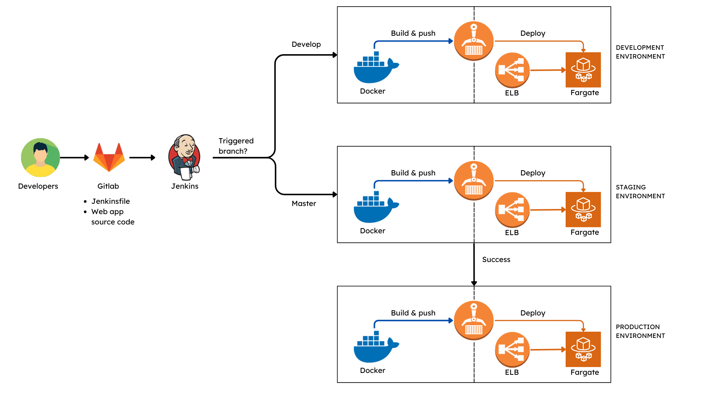

## Set up the CI/CD pipeline

### 1. Gitlab:
* The repo has 2 branches: `dev` and `master`
* Directory structure:
    ```git
    .
    ├── app
    │   └── main.py
    ├── jenkins_setup
    |   ├── docker-compose.yml
    │   └── Dockerfile
    ├── Jenkinsfile
    ├── Dockerfile
    ├── docker-compose.yml
    ├── load-balancer.yaml
    ├── .flake8
    ├── .gitignore
    ├── images
    ├── README.md
    └── requirements.txt
    ```
* The repo includes:
    * FastAPI application source code.
        ```python
        # In ./app/main.py
        from fastapi import FastAPI

        app = FastAPI()


        @app.get('/')
        async def root():
            return {'greeting': 'Hello from root function'}


        @app.get('/{name}')
        async def hello(name: str):
            return {'greeting': f'Hello {name}!'}

        ```
    * Jenskinfile: located in the root directory of the git repository `./Jenkinsfile`

    * Dockerfile and requirements.txt for the FastAPI application.
        ```dockerfile
        FROM python:3.9-slim

        WORKDIR /code

        RUN apt-get update \
        && apt-get install -y --no-install-recommends \
                curl\
        && apt-get autoremove -yqq --purge \
        && apt-get clean \
        && rm -rf /var/lib/apt/lists/*

        COPY ./requirements.txt /code/requirements.txt

        RUN pip install --no-cache-dir --upgrade -r /code/requirements.txt

        COPY ./app /code/app

        CMD ["uvicorn", "app.main:app", "--host", "0.0.0.0", "--port", "80"]

        ```
    * jenkins_setup: Dockerfile and docker-compose.yml for running jenkins server using containers:
        * Dockerfile:
        ```dockerfile
        FROM jenkins/jenkins:2.401.1
        USER root
        RUN apt-get update && apt-get install -y lsb-release
        RUN curl -fsSLo /usr/share/keyrings/docker-archive-keyring.asc \
        https://download.docker.com/linux/debian/gpg
        RUN echo "deb [arch=$(dpkg --print-architecture) \
        signed-by=/usr/share/keyrings/docker-archive-keyring.asc] \
        https://download.docker.com/linux/debian \
        $(lsb_release -cs) stable" > /etc/apt/sources.list.d/docker.list
        RUN apt-get update && apt-get install -y docker-ce-cli
        RUN apt-get install -y --no-install-recommends \
                python3-pip python3-venv\
        && apt-get autoremove -yqq --purge \
        && apt-get clean \
        && rm -rf /var/lib/apt/lists/*

        RUN pip install virtualenv
        RUN curl "https://awscli.amazonaws.com/awscli-exe-linux-x86_64.zip" -o "awscliv2.zip" && unzip awscliv2.zip && ./aws/install
        USER jenkins
        RUN jenkins-plugin-cli --plugins "blueocean docker-workflow"
        ```

        * docker-compose.yml:
        ```yml
        networks:
        jenkins:
            driver: bridge
        services:
        jenkins-docker:
            image: docker:dind
            container_name: jenkins-docker
            privileged: true
            restart: always
            networks:
            jenkins:
                aliases:
                - docker
            environment:
            - DOCKER_TLS_CERTDIR=/certs
            volumes:
            - ./jenkins-docker-certs:/certs/client
            - ./jenkins-data:/var/jenkins_home
            ports:
            - 2376:2376
            command: --storage-driver=overlay2

        jenkins-blueocean:
            image: jenkins-blueocean:2.401.1-1
            build: .
            container_name: jenkins-blueocean
            networks:
            - jenkins
            environment:
            - DOCKER_HOST=tcp://docker:2376
            - DOCKER_CERT_PATH=/certs/client
            - DOCKER_TLS_VERIFY=1
            volumes:
            - ./jenkins-docker-certs:/certs/client:ro
            - ./jenkins-data:/var/jenkins_home
            ports:
            - 8080:8080
            - 50000:50000
            restart: always

        ```
### 2. Setup AWS services:
#### 2.1 AWS ECR: Create 3 ECR repositories, one for each environment dev/staging/prod
#### 2.2 AWS ECS:
* Create a task definition for each environment: Below is the example for creating a task definition for dev environment. Create task definitions for other environments similarly and names, image uri should be changed. Configuration not mentioned ought to be left default.

    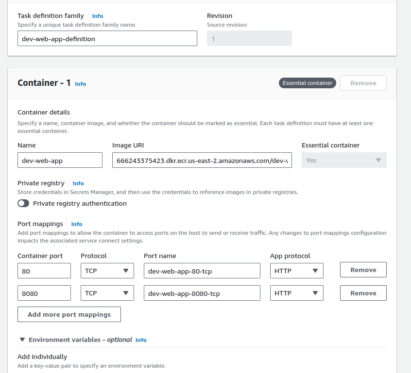
    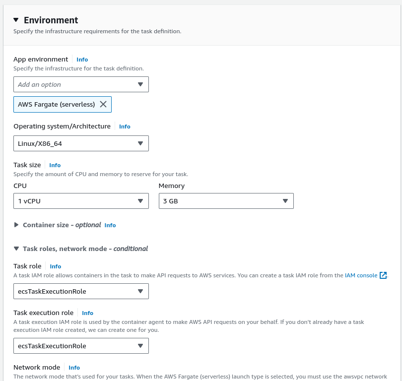

* Create a cluster for each environment: Below is the example for creating a cluster for dev environment. Create clusters for other environments similarly with other names.

    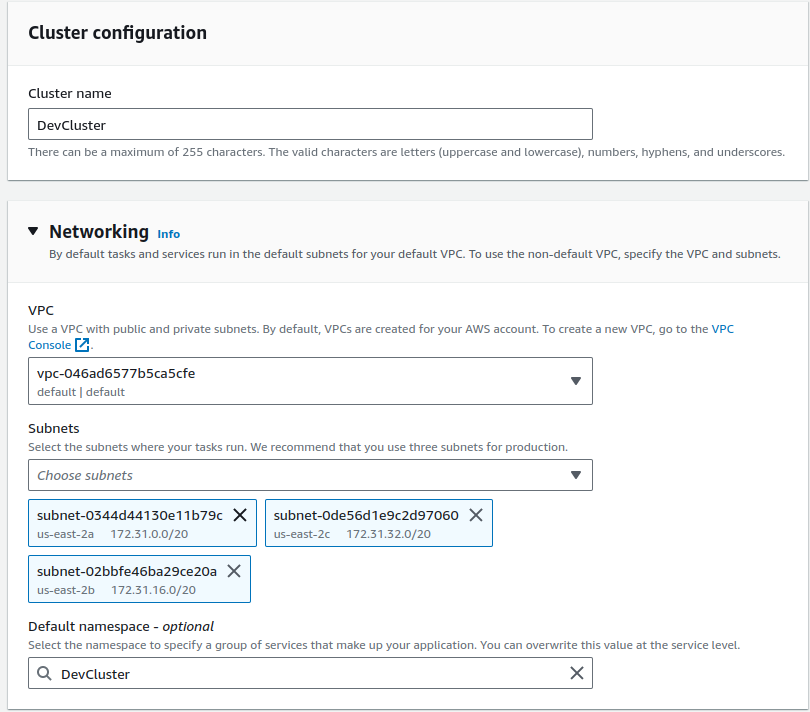
    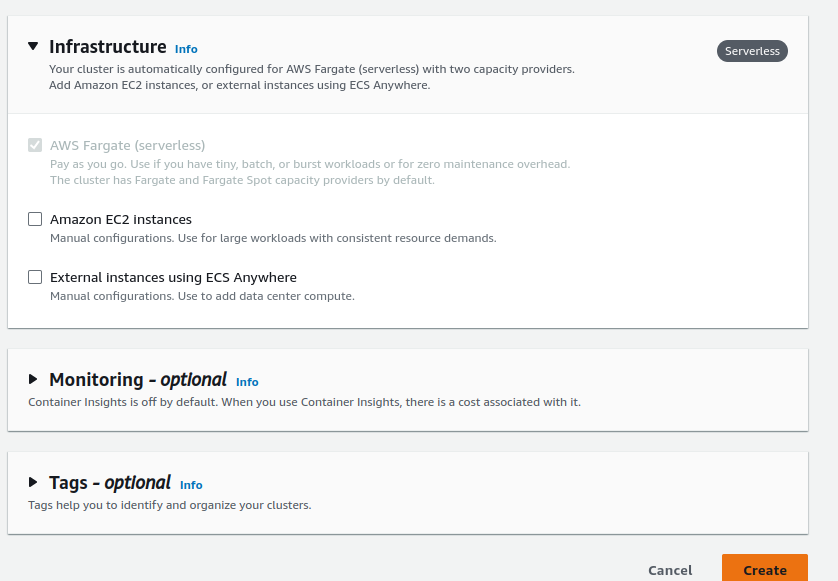

* Modify Cloudformation template for elastic load balancer: `TargetGroup/VpcId`, `LoadBalancer/Subnets`, `LoadBalancer/SecurityGroups` should be changed to meet your requirements.
    ```yml
    AWSTemplateFormatVersion: '2010-09-09'
    Description: Create a public load balancer, listener and target group.

    Resources:
    TargetGroup:
        Type: AWS::ElasticLoadBalancingV2::TargetGroup
        Properties:
        HealthCheckIntervalSeconds: 10
        HealthCheckPath: /
        HealthCheckProtocol: HTTP
        HealthCheckTimeoutSeconds: 5
        HealthyThresholdCount: 2
        TargetType: ip
        Name: !Join [ "-", [!Ref AWS::StackName, 'tg'] ]
        Port: 80
        Protocol: HTTP
        UnhealthyThresholdCount: 5
        VpcId: vpc-046ad6577b5ca5cfe

    Listener:
        Type: AWS::ElasticLoadBalancingV2::Listener
        DependsOn: 
        - TargetGroup
        - LoadBalancer
        Properties: 
        DefaultActions: 
            - Type: forward
            TargetGroupArn: !Ref TargetGroup
        LoadBalancerArn: !Ref LoadBalancer
        Port: 80
        Protocol: HTTP
    
    LoadBalancer:
        Type: AWS::ElasticLoadBalancingV2::LoadBalancer
        Properties: 
        IpAddressType: ipv4
        Name: !Join [ "-", [!Ref AWS::StackName, 'bl'] ]
        Scheme: internet-facing
        SecurityGroups: 
            - sg-04741693a6494256c
        Subnets: 
            - subnet-0344d44130e11b79c
            - subnet-0de56d1e9c2d97060
            - subnet-02bbfe46ba29ce20a

    Outputs:
    LoadBalancerDNS:
        Description: The DNS of the Elastic Load Balancer of the web app
        Value: !GetAtt LoadBalancer.DNSName
    LoadBalancerFullName:
        Description: The LoadBalancerFullName of the Elastic Load Balancer of the web app
        Value: !GetAtt LoadBalancer.LoadBalancerFullName
    TargetGroupArn:
        Description: The TargetGroupArn of the Target group
        Value: !GetAtt TargetGroup.TargetGroupArn

    ```

* Modify `Jenkinsfile` in source repository: Look for all lines that contain the `--network-configuration` term and modify its to meet your requirements like below:
    ```
    --network-configuration "awsvpcConfiguration={subnets=[{YOUR_SUBNET_ID_1},{YOUR_SUBNET_ID_2},{YOUR_SUBNET_ID_3},{...}],securityGroups=[{YOUR_SECURITY_GROUP_ID_1},{...}],assignPublicIp=ENABLED}" \
    ```

* Take a look at `parameters` section in the `Jenkinsfile` and modify parameters' default values so that it meets your needs:
    * AWS account id: AWS_ACCOUNT_ID
    * AWS default region: AWS_REGION
    * Created ECR repo names: *_ECR_REPO
    * Created ECS cluster names: *_CLUSTER
    * Created ECS task definition names: *_TASK_DEFINITION
    * Defined container names in the created task definitions: *_CONTAINER
    * Container port in the created task definitions: CONTAINER_PORT
    * ECS service names for deployment: *_SERVICE
    * Elastic load balancer stack names which will be created during the deployment process: *_LOAD_BALANCER_STACK
### 3. Setup Jenkins server using AWS EC2:
* Launch an EC2 instance: Remember to expose port 8080 for accessing Jenkins web server
    
    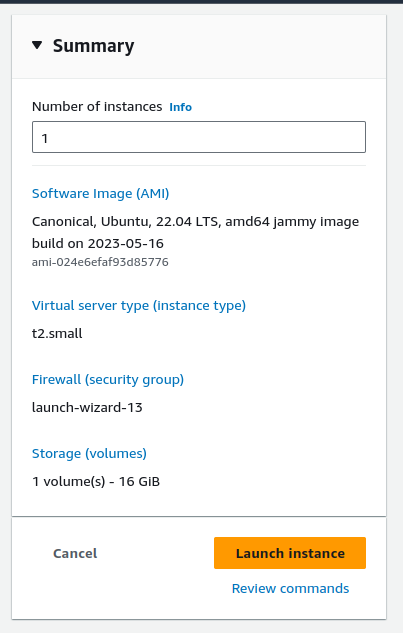

* Copy `./jenkins_setup` folder to the instance. SSH to the EC2 instance, change the working directory to it and run this command:
    ```sh
    # Inside jenkins_setup folder
    curl -fsSL https://get.docker.com -o get-docker.sh
    sudo sh get-docker.sh
    mkdir jenkins-data jenkins-docker-certs
    sudo docker compose up
    ```

* Access Jenkins web server using the instance IP with port 8080 using the initial password shown in the output of the above commands

    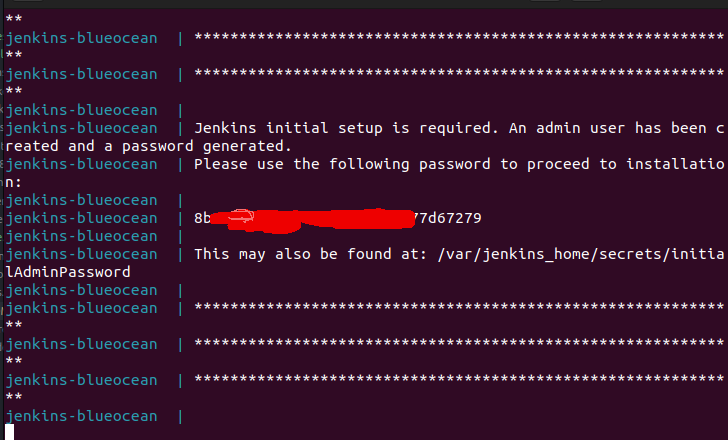

* Install plugins:

    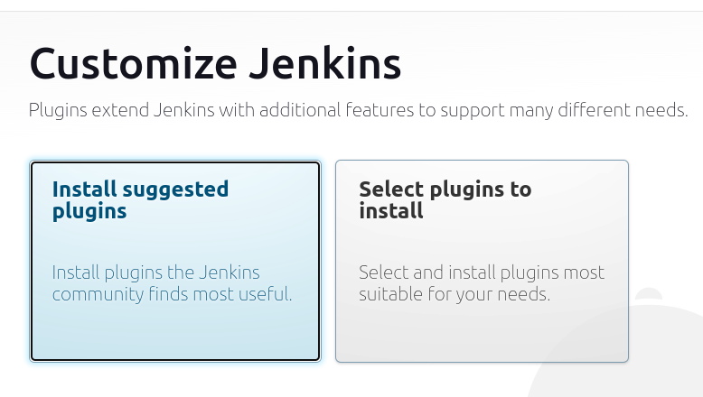

* Create an admin user:

    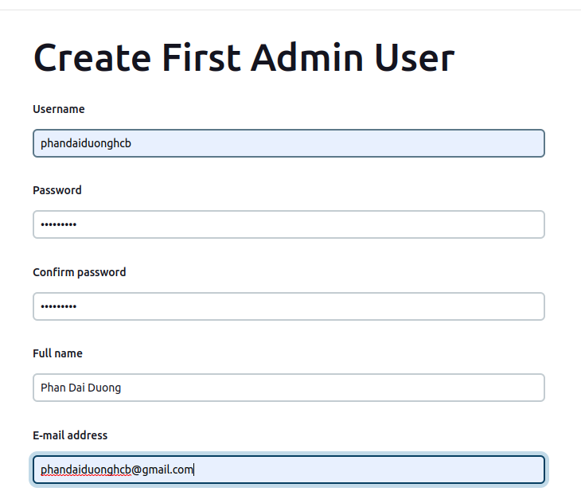

* Assign Jenkins url:

    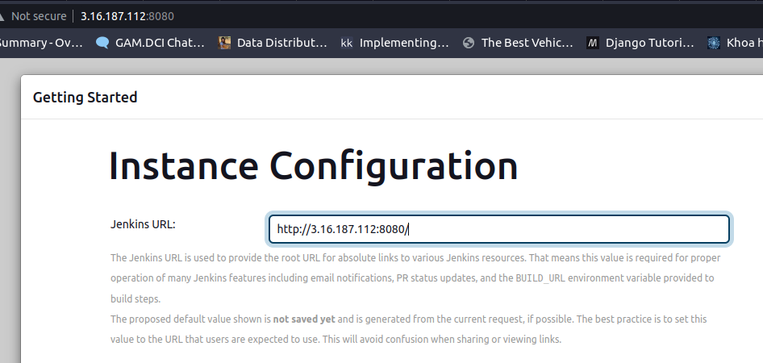
    
* Install additional plugins: Manage Jenkins -> Plugins -> Available Plugins -> Search `Pipeline: AWS Steps` and check it -> Install without restart -> Go back to the top page

    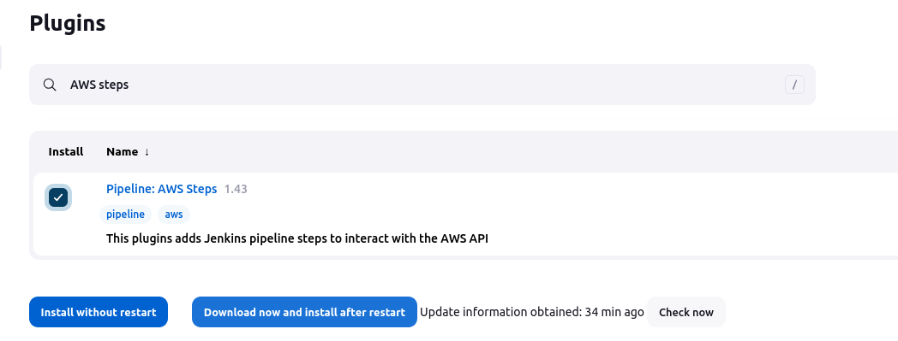
* Add AWS credentials: Manage Jenkins -> Credentials -> System -> Global credentials (unrestricted) -> Add Credentials:
    > **IMPORTANT:** Replace 'duongpd7-aws-credentials' in `Jenkinsfile` of the source repository with your ID of the credentials created below

    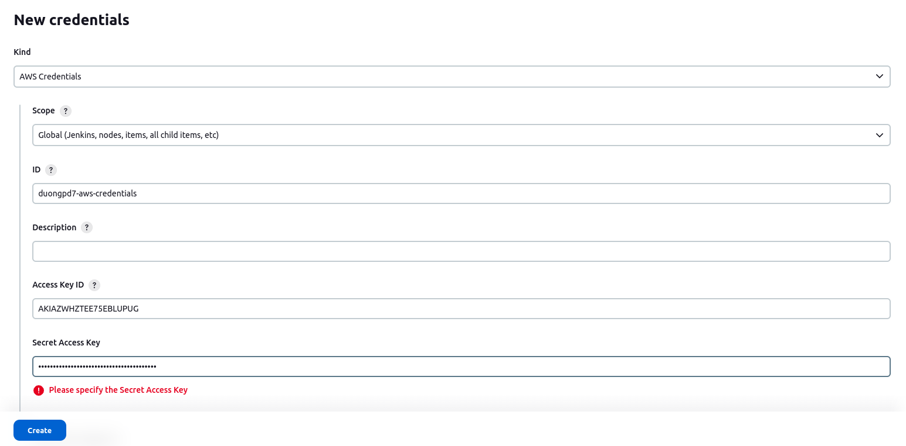
* Set up Jenkins pipeline:
    * Click Open Blue Ocean:
    
        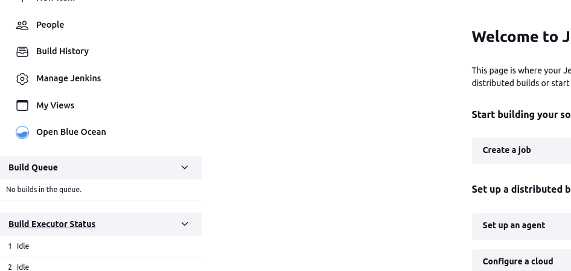

    * Create a new Pipeline:
        
        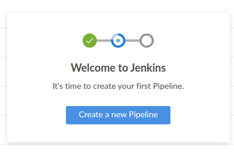

    * Configure source repository for the pipeline: choose `Git` , configure your gitlab repository URL, add your credential information and click `Create pipeline`:
        >**IMPORTANT**: Assign your Gitlab Personal access token (not your Gitlab password) to the Password field. Refer to the section `Create a personal access token` at <a href="https://docs.gitlab.com/ee/user/profile/personal_access_tokens.html">Personal access tokens</a>

        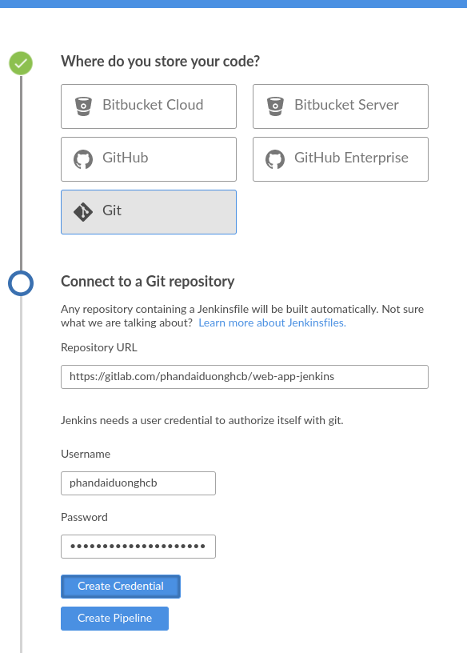

    * After that, the pipeline will be triggered automatically for 2 branches: `master` and `dev`. Both of them should run successfully!
    > **Note:** You need to click Proceed to continue to the production deployment process

    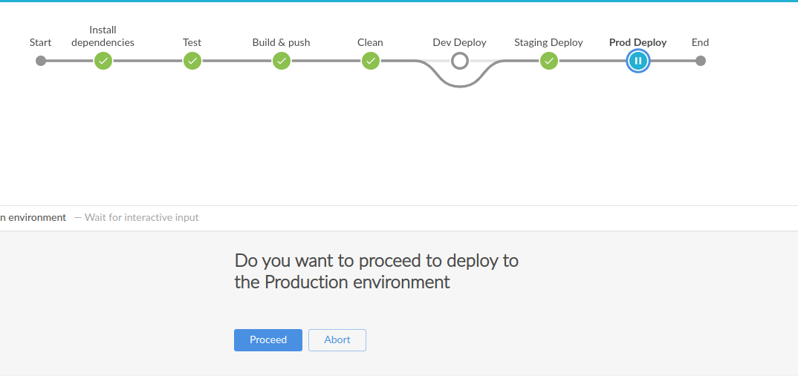

### 4. Create a Gitlab webhook for triggering the pipeline

* Install Gitlab plugin: Manage Jenkins -> Plugins -> Available Plugins -> Search `Gitlab` and check it -> Install without restart -> Go back to the top page

    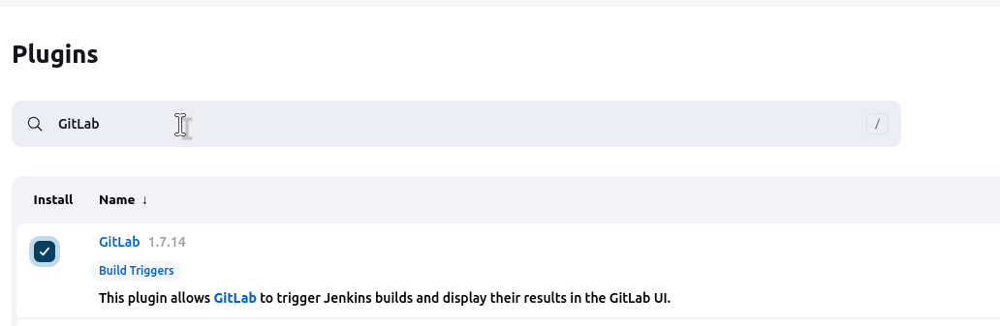

* Acess your Gitlab repository and Click webhook button in the setting section

    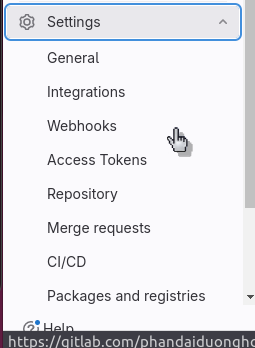

* Create a webhook like the example below. Replace YOUR_JENKINS_URL with your jenkins server url.

    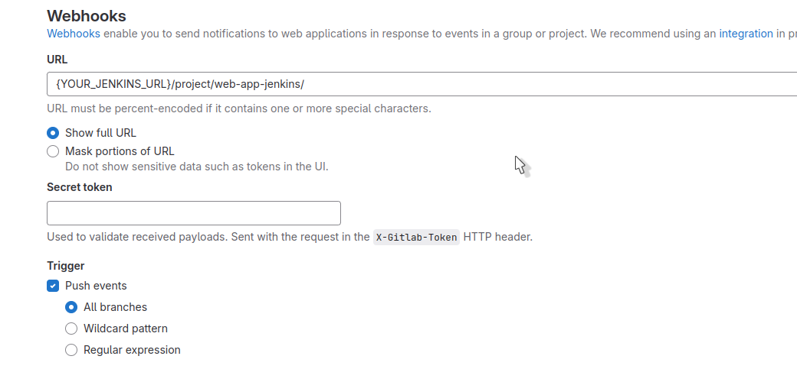

* Test your webhook and the success notification should appear

    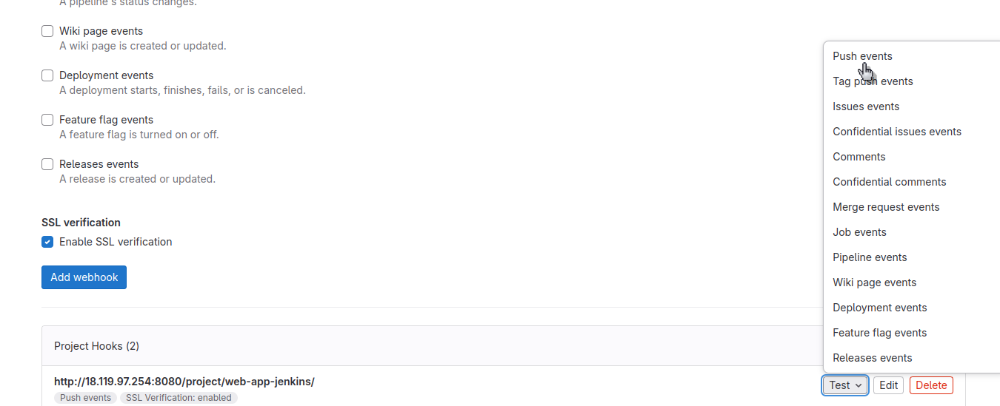

    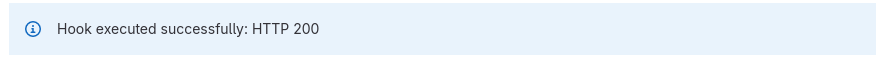

* Now Jenkins will trigger the pipeline whenever there is a push to the Gitlab repository
<!-- <p align="right">(<a href="#readme-top">back to top</a>)</p> -->
## Referenes:
* <a href="https://www.jenkins.io/doc/book/installing/docker/">Installing Jenkins using Docker</a>
* <a href="https://www.jenkins.io/doc/tutorials/build-a-multibranch-pipeline-project/">End-to-End Multibranch Pipeline Project Creation </a>
* <a href="https://aws.amazon.com/blogs/compute/building-a-jenkins-pipeline-with-aws-sam/" >Building a Jenkins Pipeline with AWS SAM</a>
* <a href="https://plugins.jenkins.io/gitlab-plugin/#plugin-content-webhook-url">Jenkins webhook url for gitlab<a/>
* <a href="https://fastapi.tiangolo.com/">FastAPI</a>


<!-- ## Contact

Phan Dai Duong - phandaiduong@gmail.com

Project Link: [https://github.com/github_username/repo_name](https://github.com/github_username/repo_name)

<p align="right">(<a href="#readme-top">back to top</a>)</p> -->


<!-- MARKDOWN LINKS & IMAGES -->
<!-- https://www.markdownguide.org/basic-syntax/#reference-style-links -->
[contributors-shield]: https://img.shields.io/github/contributors/github_username/repo_name.svg?style=for-the-badge
[contributors-url]: https://github.com/github_username/repo_name/graphs/contributors
[forks-shield]: https://img.shields.io/github/forks/github_username/repo_name.svg?style=for-the-badge
[forks-url]: https://github.com/github_username/repo_name/network/members
[stars-shield]: https://img.shields.io/github/stars/github_username/repo_name.svg?style=for-the-badge
[stars-url]: https://github.com/github_username/repo_name/stargazers
[issues-shield]: https://img.shields.io/github/issues/github_username/repo_name.svg?style=for-the-badge
[issues-url]: https://github.com/github_username/repo_name/issues
[license-shield]: https://img.shields.io/github/license/github_username/repo_name.svg?style=for-the-badge
[license-url]: https://github.com/github_username/repo_name/blob/master/LICENSE.txt
[linkedin-shield]: https://img.shields.io/badge/-LinkedIn-black.svg?style=for-the-badge&logo=linkedin&colorB=555
[linkedin-url]: https://linkedin.com/in/linkedin_username
[product-screenshot]: images/screenshot.png
[Next.js]: https://img.shields.io/badge/next.js-000000?style=for-the-badge&logo=nextdotjs&logoColor=white
[Next-url]: https://nextjs.org/
[React.js]: https://img.shields.io/badge/React-20232A?style=for-the-badge&logo=react&logoColor=61DAFB
[React-url]: https://reactjs.org/
[Vue.js]: https://img.shields.io/badge/Vue.js-35495E?style=for-the-badge&logo=vuedotjs&logoColor=4FC08D
[Vue-url]: https://vuejs.org/
[Angular.io]: https://img.shields.io/badge/Angular-DD0031?style=for-the-badge&logo=angular&logoColor=white
[Angular-url]: https://angular.io/
[Svelte.dev]: https://img.shields.io/badge/Svelte-4A4A55?style=for-the-badge&logo=svelte&logoColor=FF3E00
[Svelte-url]: https://svelte.dev/
[Laravel.com]: https://img.shields.io/badge/Laravel-FF2D20?style=for-the-badge&logo=laravel&logoColor=white
[Laravel-url]: https://laravel.com
[Bootstrap.com]: https://img.shields.io/badge/Bootstrap-563D7C?style=for-the-badge&logo=bootstrap&logoColor=white
[Bootstrap-url]: https://getbootstrap.com
[JQuery.com]: https://img.shields.io/badge/jQuery-0769AD?style=for-the-badge&logo=jquery&logoColor=white
[JQuery-url]: https://jquery.com 